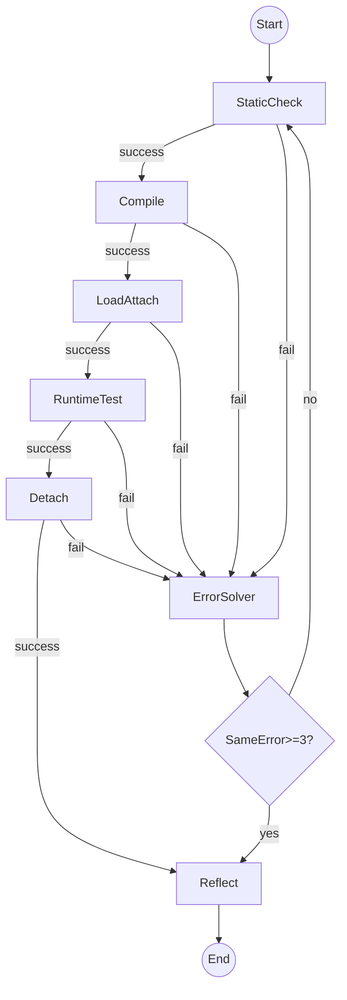

## 项目整体流程

source code(prog.bpf.c) -> static_check -> compile -> load_and_attach -> test -> reflect

### 目标语义（可执行级定义）
- 每个阶段都会**落盘**一个结构化 `*_result*.json` 文件，并由 coordinator **读取该文件中的 `success` 字段**决定是否进入下一阶段。
- 任一阶段失败（`success=false`）：进入 `Error_solver` 进行修复（写入 `retry_code/`，不覆盖 `data/` 原始源码），修复后从 `static_check` 重新开始。
- 若“相同报错签名（error_signature）”连续出现 **3 次**仍未解决：停止修复，直接进入 `Reflect`。
- 每个 case 都会运行 `Reflect`：输出分析报告，并在发现“可复用新模式”时更新 `repair_method.yaml`。

### 单 case 的 LangGraph 拓扑（状态机）


---

## LangGraph 状态定义（State）
为保证“内存态”与“文件态”同构，建议用 TypedDict/Dataclass 定义如下最小状态（字段都可序列化）：

```python
class CaseState(TypedDict, total=False):
    # 基本身份与路径
    category: str
    case_rel: str
    case_display: str
    logs_dir: str
    build_dir: str

    # 当前工作文件（修复时会指向 retry_code 版本）
    original_source_file: str
    current_source_file: str
    object_file: str
    pin_path: str
    program_type: str | None
    vmlinux_header_dir: str | None

    # 阶段产物路径（都落在 logs_dir 下；多源文件用 *_<stem>.json）
    static_check_path: str
    compile_result_path: str
    load_result_path: str
    attach_result_path: str
    runtime_result_path: str
    detach_result_path: str
    deploy_result_path: str

    # 阶段内存态（来自对应 result.json 的内容）
    static_check: dict
    compile: dict
    load: dict
    attach: dict
    runtime: dict
    detach: dict
    deploy: dict

    # 修复循环控制
    attempt_index: int                     # 从 1 开始：第 n 次写入 retry_code/<case>.<n>.bpf.c
    patch_history: list[str]               # diff_sig 列表（防循环）
    retry_code_paths: list[str]            # 每次生成的源码路径
    error_signature_counts: dict[str, int] # 错误签名 -> 出现次数
    last_error_signature: str | None

    # 终局产物
    repair_report_path: str | None         # 仅失败/跳 Reflect 时生成 repair_report.json
    reflect_report_md: str
    reflect_report_json: str
```

### 错误签名（SameError 的判定）
错误签名必须“短且稳定”，建议：
- `stage + ':' + verifier.primary_error_type`（load_failed 场景）
- compile_failed 场景：`compile_failed:<first_key_error_line>`（可裁剪/归一化）
实现可复用当前 `src/agent/coordinator.py::_stable_error_signature()`，并补齐 compile_failed 的 fallback。

## 实现 error_solver agent
error_solver agent 是主要的 agent，用于分析问题和解决问题。其输入来自：失败阶段、该阶段 `*_result*.json`、错误信息摘要、`repair_method.yaml`、以及 `prompt/Info.py` 提供的 `tool_api/usable_files`。

### Error_solver 输出与落盘
- **修复过程落盘**：每个 case 的 `logs_dir` 下必须包含可追溯信息：
  - `agent_trace.md/jsonl`（沿用 `src/agent/trace.py`）
  - `retry_code/<case>.<n>.bpf.c`（每次候选修复源码）
- **修复报告 `repair_report.json`**：仅当最终失败或触发 “SameError>=3” 跳转 Reflect 时生成（成功部署则不生成）。建议结构：

```json
{
  "case_display": "verifier/kernel_struct/xxx.bpf.c",
  "final_stage": "load_failed|compile_failed|...",
  "same_error_threshold": 3,
  "error_signature_counts": {"load_failed:invalid_mem_access": 3},
  "attempts": [
    {
      "attempt_index": 1,
      "source_file": "output/.../retry_code/case.1.bpf.c",
      "diff_sig": "....",
      "confidence": 0.7,
      "rationale": "...",
      "stage_results": {
        "compile_result": "compile_result.json",
        "load_result": "load_result.json",
        "attach_result": "attach_result.json",
        "runtime_result": "runtime_result.json"
      }
    }
  ]
}
```


agent基类伪代码 (可使用langraph?)
```
# 类字段 - 配置模型
config_model: type[AgentConfig] = AgentConfig

# 核心属性
- self.llm: LLM 实例
- self.config: Agent 配置, 放在根目录configs下
- self.tools: 工具列表
- self.prompt: 提示词

# 抽象方法 - 子类必须实现
@abstractmethod
def step(self, state: State) -> Action

# 关键方法
+ complete: bool  # 完成状态标志
```

error_solver agent 
```
# 属性
- self.max_attempts: 最大尝试次数

# 方法
+ record_entire_repair_process: str # 输出整个修改过程
+ record_step_repair_summary: str # 输出本次修改模式的摘要
```

reflect agent类
```
+ update_repair_method: bool # 总结修改过程, 提炼修复模式到repair_method文件.
```

---

## Reflect Agent（反思与记忆提炼）
### 目标
- 生成每个 case 的分析报告（无论最终成功/失败）。
- 从“失败 →（若有）修复尝试 → 终局结果”中提炼**可复用模式**，并更新到 `knowledge_base/repair/repair_method.yaml`。

### Reflect 输入
- `repair_report.json`（若存在）/ `agent_trace.*` / 全套 `*_result*.json` / 当前内核画像 `kernel_profile.json`。

### Reflect 输出
- `reflect_report.md`（人读，便于调试与复盘）
- `reflect_report.json`（机器读，便于统计/训练）
- `repair_method.yaml` 的增量更新（去重 + 追加证据）

---

## repair_method.yaml 规范（结构化知识库）
将当前纯文本 `knowledge_base/repair/repair_method` 迁移为 YAML（并可保留旧文件作为 legacy）。推荐文件：`knowledge_base/repair/repair_method.yaml`

### 顶层结构
```yaml
version: 1
updated_at: "2026-03-18T00:00:00Z"
rules:
  - id: "compile_missing_headers"
    stage: "compile_failed"
    error_signature: "compile_failed:missing_declaration"
    symptoms:
      - pattern: "implicit declaration of function"
      - pattern: "unknown type name"
    root_cause: "缺少必要的头文件或宏定义（SEC/辅助宏）"
    fix_strategy:
      - "补全 linux/bpf.h 与 bpf/bpf_helpers.h 等常用头文件"
      - "保持最小改动，避免引入业务无关逻辑"
    constraints:
      kernel_min: null
      requires_btf: null
    examples:
      - case: "verifier/kernel_struct/foo"
        report: "output/6.8/log/verifier/kernel_struct/foo/reflect_report.json"
```

### Reflect 的更新策略（必须确定性、可去重）
- **去重键（优先）**：`stage + error_signature`；若 error_signature 缺失则对 `symptoms.pattern` 做指纹（排序后 hash）。
- **命中**：追加 `examples`，必要时补充 `constraints`/更精炼的 `fix_strategy`。
- **未命中**：append 新 rule，并生成稳定 `id`（例如基于 stage+signature 的 slug）。

---

## 可用工具列表

所有可用工具应该放在src/agent/tools下. 包括:
```
- run_command
- read_file
- file_editor
```

### 工具定义结构
```
按照OpenAI function calling format定义
```

### 工程现状对齐（以现有实现为准）
当前工具 schema 已在 `prompt/tools.json` 与 `prompt/Info.py` 中维护，包含：
- `StaticCheckTool / CompilerTool / LoadAttacherTool / TesterTool / DetachTool / Coordinator`


## step大致流程参考:
```
def step(state: State) -> Action:
    # 1. 处理待执行动作队列
    if self.pending_actions:
        return self.pending_actions.popleft()
    
    # 2. 检查退出信号
    if 到大最大次数限制 or 遇到特定超出能力范围问题:
        return AgentFinishAction()
    
    # 3. 对话历史压缩
    condensed_history = self.condenser.condensed_history(state)
    
    # 4. 构建 LLM 消息
    messages = self._get_messages(events, initial_user_message, forgotten_event_ids)
    
    # 5. 调用 LLM
    response = self.llm.completion(**params)
    
    # 6. 解析响应为动作
    actions = self.response_to_actions(response)
    
    # 7. 入队并返回第一个动作
    for action in actions:
        self.pending_actions.append(action)
    return self.pending_actions.popleft()
```


