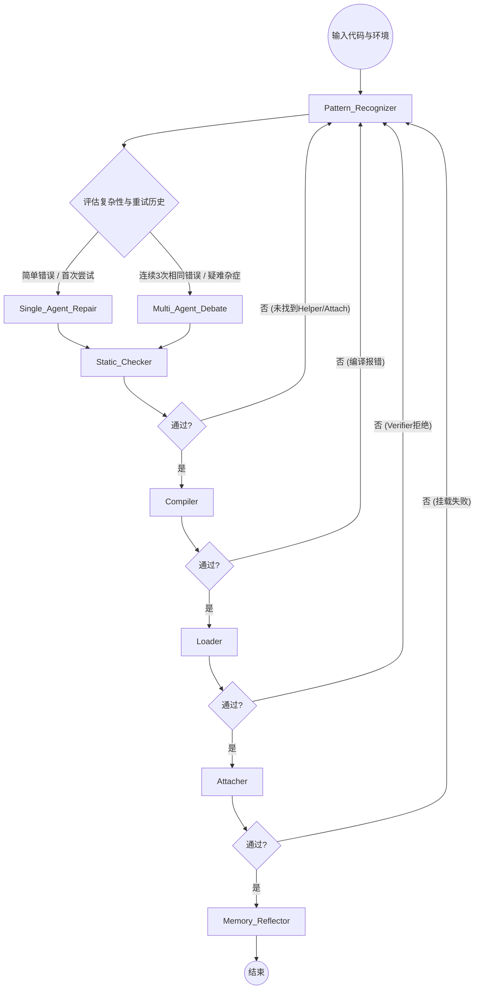

# eBPF Agent 智能推理系统设计方案（基于 LangGraph）

本方案针对跨内核 eBPF 自动部署框架中的核心 Agent 模块进行了详细设计。系统采用 **LangGraph** 作为底层流程编排框架，融合了前沿的大模型多智能体（Multi-Agent）与认知架构理念，具备显著的科研创新价值。

---

## 1. 科研创新点 (Research Novelties)

1. **双态认知架构 (Dual-Process Cognitive Architecture)**
   借鉴人类心理学“快思考与慢思考”（System 1 & System 2）模型：
   - **System 1 (快思考)**：单 Agent 执行模式，基于“模式识别 (Pattern Recognition) + 规则匹配 + 单体 LLM 修复”，能够快速、低成本地解决 80% 常见的 eBPF 兼容性报错。
   - **System 2 (慢思考)**：当单 Agent 连续修复失败或判错置信度极低时，动态切换为 **多 Agent 辩论模式 (Multi-Agent Debate)**，引入不同“专家角色”进行多维度的代码逻辑、内核源码机制验证，解决复杂跨字段依赖或未知的 Verifier 难题。

2. **自演化模式识别与记忆提炼 (Self-Evolving Memory & Pattern Extraction)**
   系统并非只是简单地将历史失败写入 RAG，而是具备**自反思 (Reflection) 计算机制**。每次部署结束后，触发 `Memory_Reflector` 节点，对比失败路径与最终成功路径，利用 LLM 从中提炼出高度抽象的“内核版本特征陷阱”与“代码重构范式”，动态更新至 `Pattern DB`。实现系统“越用越聪明”。

3. **图驱动的环路防死锁机制 (Graph-based Cyclic Deadlock Prevention)**
   通过 LangGraph 的状态管理 (StateGraph)，在节点状态中显式维护 `Action History` 和 `Semantic Diff`，当检测到 Agent 在循环修改中产生“乒乓效应”（来回修改相同代码）或差异趋于零时，图路由边 (Conditional Edge) 强制打断循环，升级干预手段。

---

## 2. 系统核心机制与状态定义

### 2.1 状态空间定义 (AgentState)
LangGraph 需要定义全局状态传递。我们的 `eBPF_State` 定义如下：

```python
class eBPF_State(TypedDict):
    original_code: str         # 原始 eBPF 源码
    current_code: str          # 当前修改后的代码
    kernel_profile: dict       # 目标主机内核画像 (版本、BTF可见性等) 对应kernel_profile.json
    verifier_logs: List[str]   # 各阶段报错日志 (静态检查、编译、Verifier加载等)
    static_check_result: dict  # 静态检查结果 (Helper函数与Attach点是否存在) 对应static_check.json (兼容历史 static_check_report.json)
    compile_result: dict       # 编译结果 (对应 compile_result.json)
    load_result: dict          # 加载结果 (对应 load_result.json)
    attach_result: dict        # 挂载结果 (对应 attach_result.json)
    error_types: List[str]     # 模式识别标注的错误类型
    patch_history: List[str]   # 历史修改 diff（防御死循环）
    retry_count: int           # 当前重试次数
    debate_history: List[str]  # 记录多Agent讨论上下文
    final_status: str          # success / failed_with_report
```

### 2.2 四大核心机制
1. **RAG 机制**：包含三类数据（内核官方文档、BPF 邮件列表历史 Patch、本地历史修复经验库）。采用混合检索（向量相似度 + error_type 关键词过滤）。
2. **模式识别机制 (Pattern Recognition)**：通过精调的模型或静态正则化手段，将大段难以约束的 Verifier 日志转化为结构化的 `error_type`（如 `invalid_mem_access`, `unbounded_loop`），指导 RAG 的高精度召回。
3. **分层记忆机制 (Hierarchical Memory)**：
   - **短期记忆 (Scratchpad)**：本次任务过程中的尝试、错误与 Patch，仅存活于当前 LangGraph 生命周期。
   - **长期记忆 (Semantic & Episodic)**：经过 `Reflector` 提炼的业务逻辑范式，全局复用。
4. **单/多 Agent 动态切换机制**：路由节点根据 `retry_count` 及 `error_types` 里是否有重复出现的疑难杂症，决定流向单体修复图还是多专家讨论图。

### 2.3 Agent 输入输出设计 (I/O Contract)

为确保 LangGraph 节点可插拔、可追踪、可回放，I/O 设计分为三层：`任务入口输入`、`节点级结构化输入输出`、`文件系统落盘输出`。

#### 2.3.1 任务入口输入 (Run Input)

每次任务由上层调度器构造统一的 `run_request`，建议字段如下：

```json
{
  "request_id": "uuid-or-timestamp",
  "kernel_version": "5.15|6.6|...",
  "case_category": "feature|helper_func|kernel_struct|verifier",
  "case_name": "attach_type_unsupported|...",
  "data_dir": "data/<category>/<case_name>",
  "logs_dir": "output/<kernel>/log/<category>/<case_name>",
  "build_dir": "output/<kernel>/build/<category>/<case_name>",
  "kernel_profile_path": "output/<kernel>/log/kernel_profile.json",
  "bpftool_probe_path": "output/<kernel>/log/bpftool_feature_probe.json",
  "max_retry": 3,
  "debate_trigger_retry": 2
}
```

说明：
- `data_dir` 对应仓库中的样例目录（如 `data/feature/*`、`data/helper_func/*`）。
- `logs_dir/build_dir` 与当前工程输出结构保持一致（`output/<kernel>/log|build/...`）。
- `kernel_profile_path` 与 `bpftool_probe_path` 作为上下文输入，供 Pattern/RAG/静态检查共享。

#### 2.3.2 节点级输入输出 (Node I/O)

1. `Pattern_Recognizer`
- 输入：`current_code`、`verifier_logs`、`kernel_profile`、最近一次失败阶段（`compile|load|attach|static_check`）。
- 输出：
  - `error_types: List[str]`（如 `invalid_mem_access`, `unbounded_loop`）
  - `key_lines: List[str]`（关键报错行）
  - `rag_context: List[dict]`（召回到的文档/历史修复片段）

2. `Single_Agent_Repair`
- 输入：`current_code`、`error_types`、`rag_context`、`kernel_profile`、`patch_history`。
- 输出：
  - `patched_code: str`
  - `patch_diff: str`
  - `confidence: float`（0-1）
  - `repair_rationale: str`

3. `Multi_Agent_Debate`
- 输入：`current_code`、`error_types`、`debate_history`、`kernel_profile`、`retry_count`。
- 输出：
  - `consensus_patch: str`
  - `consensus_diff: str`
  - `evidence`: 
    - `kernel_evidence: List[str]`
    - `verifier_trace: List[str]`
    - `engineering_tradeoff: str`

4. `Static_Checker`
- 输入：AST 摘要（由 `scripts/setup/ast_parser.py` 生成）、`kernel_profile`。
- 输出：`static_check_result`，建议最小结构：

```json
{
  "kernel_version": "5.15.0-...",
  "summary": {"error_count": 0, "warning_count": 1},
  "results": []
}
```

5. `Compiler`
- 输入：`current_code`（或临时写入后的 `.bpf.c` 文件）、目标产物路径、编译模式（`core/non-core/auto`）。
- 输出（对应 `compile_result.json`）：`success`、`returncode`、`stderr/stdout`、`compile_mode`、`vmlinux_header`。

6. `Loader`
- 输入：编译产物 `.bpf.o`、`program_type`、`pin_path`。
- 输出（对应 `load_result.json`）：`success`、`verifier.primary_error_type`、`verifier.error_types`、`stderr/stdout`。

7. `Attacher`
- 输入：`load_result` + attach 计划（target/attach_type）。
- 输出（对应 `attach_result.json`）：`success`、`reason|stderr`、`attach plan`。

8. `Memory_Reflector`
- 输入：`original_code`、`current_code`、`patch_history`、全流程失败/成功日志。
- 输出：
  - `knowledge_piece.json|md`（结构化经验）
  - 可选写入向量库的 `embedding_payload`

#### 2.3.3 文件输出与落盘规范 (File I/O)

单 case 最小落盘产物：
- `ast_summary.json`
- `static_check.json`（兼容读取历史名 `static_check_report.json`）
- `compile_result.json`
- `load_result.json`
- `attach_result.json`
- `detach_result.json`
- `deploy_result.json`
- `pipeline_report.json`

多源文件（同一 case 下多个 `.bpf.c`）时，采用后缀化命名：
- `compile_result_<stem>.json`
- `load_result_<stem>.json`
- `attach_result_<stem>.json`
- `deploy_result_<stem>.json`

聚合报告（内核维度）：
- `output/<kernel>/log/pipeline_report.json`
- `output/<kernel>/log/kernel_profile.json`
- `output/<kernel>/log/bpftool_feature_probe.json`

#### 2.3.4 状态字段与文件映射

- `kernel_profile` <-> `kernel_profile.json`
- `static_check_result` <-> `static_check.json`
- `compile_result` <-> `compile_result*.json`
- `load_result` <-> `load_result*.json`
- `attach_result` <-> `attach_result*.json`
- `final_status` + `retry_count` + `patch_history` -> 汇总到 `pipeline_report.json` 的 `summary/deploy_results`

通过以上映射，Agent 在内存态 (StateGraph) 与磁盘态 (JSON Artifacts) 保持同构，便于调试回放、失败复现与后续训练数据沉淀。

---

## 3. LangGraph 节点与工作流拓扑设计

系统的执行图通过 `StateGraph` 构建，由以下关键节点 (Nodes) 与路由边 (Conditional Edges) 组成：

### 3.1 图节点说明 (Nodes)

- **`Node: Pattern_Recognizer` (模式识别与上下文补齐)**
  - 接收原始代码与 Verifier 报错。
  - 提取关键报错行，识别错误种类，并调用 RAG 接口检索相关场景的修复示例。
  
- **`Node: Single_Agent_Repair` (单 Agent 修复单兵)**
  - 基于提示词引擎，结合 RAG 结果与 `KernelProfile`，生成针对性的代码 Patch。要求 Agent 输出最小改动代码并给出“修复置信度 (Confidence)”。

- **交互工具模块流水线 (Tool Execution Pipeline)**
  将环境验证拆分为精细的模块流水线。**任何阶段失败 (Failed) 将生成含有错误日志的结果 JSON，并触发状态流转，跳转至 `Pattern_Recognizer` 启动修复阶段：**
  - **`Node: Static_Checker` (静态检查)**：检查代码中使用的 eBPF Helper 函数在目标内核是否可用，以及定义的 Attach 挂载点（如 kprobe / tracepoint）是否存在。失败则报错短路。
  - **`Node: Compiler` (代码编译)**：调用 llvm/clang 编译 `current_code` 成字节码。输出 `compile_result.json`（成功/失败、报错位置）。
  - **`Node: Loader` (内核加载)**：提取字节码并在内核进行 BPF Verifier 加载校验。输出 `load_result.json`（包含具体 Verifier 拒绝日志，如寄存器超界、权限不足）。
  - **`Node: Attacher` (钩子挂载)**：将加载好的 bpf prog 固定或挂载到指定事件源上。输出 `attach_result.json`。

- **`Node: Multi_Agent_Debate` (多专家讨论会议)**
  包含三个子 Agent 的子图 (SubGraph)：
  - **`Kernel_Expert`**：基于内核版本演进历史，批判代码中不兼容的结构体访问及 Helper 调用。
  - **`Verifier_Inspector`**：专精 eBPF 虚拟机检验安全规则，排查由于寄存器溢出、指针未校验引起的异常。
  - **`Software_Engineer`**：结合前两者的批判意见，负责统筹生成最终满足业务逻辑的替代代码方案 (如降级到 perf_event)。
  上述三个角色进行 2-3 轮对话后，合并输出一份高质量的重构方案。

- **`Node: Memory_Reflector` (经验总结提取)**
  - 终局节点。在部署成功或最终失败时触发。分析本次所有的错误与修复路径，若发现 RAG 中未有的新解法，生成结构化的经验知识点，存入向量数据库，实现系统自适应学习。

### 3.2 图路由流转逻辑 (Edges)



---

## 4. 实施细节与算法设计

### 4.1 "越用越聪明" 的 Reflector 提炼算法
当程序在经历了数次失败，并在某次 Single_Agent 或 Multi_Agent 的修改下终于编译通过时，系统会截取 `Original_Code` 与 `Final_Success_Code`。
提炼 Prompt 模板示例：
> "你是一个 eBPF 专家总结系统。请分析我们从失败到成功的解决路径。
> 初始错误为：{initial_error}
> 在内核版本 {kernel_version} 下，最终成功的关键修改差异是：{diff_content}
> 请用一段通用的规则描述和一段精简的替代代码范例来总结本次经验，抛弃具体的业务逻辑变量名，抽象出通用模式，以便未来遇到此类错误时直接作为参考。"

产出的知识（Knowledge Piece）将插入 ChromaDB 等向量库，作为后续任务的高优 RAG 策略。

### 4.2 多 Agent 讨论 (Debate) 防止发散机制
为防止多个 LLM 在讨论中无限发散，引入**“结构化举证机制”**和**“终值裁决器机制”**。
- `Kernel_Expert` 必须引用具体的内核文档片段进行发言。
- `Verifier_Inspector` 若认为不安全，必须输出模拟的寄存器流转出错点。
- 由一个专门的 `Coordinator` (主节点) 负责倒计时。在经历最多 3 轮辩论后，强制要求各方达成一致提供 Patch 并在系统中重试，否则作为失败丢出，防止 token 无谓消耗。

---

## 5. 实施阶段规划 (Implementation Roadmap)

系统的开发实施将分为以下五个阶段，从基础环境打通逐渐过渡到高级智能特性。

### 阶段一：基础设施与工具链对接 (Infrastructure & Tooling)
- **目标**：搭建底层执行环境，完成 eBPF 编译/加载工具和 Python 的接口封装。
- **任务**：
  - 基于现有仓库结构对齐工程入口与目录映射（避免设计与实现脱节）：
    - 工具入口脚本：`scripts/tools/run_deploy.py`、`scripts/tools/run_static_check.py`
    - AST 与内核信息收集：`scripts/setup/ast_parser.py`、`scripts/setup/kernel_info_collector.py`
    - 部署执行实现（编译/加载/挂载/运行/卸载）：`src/agent/deploy/executor.py`
    - 典型数据与输出目录：`data/`、`output/`、`tests/data`、`tests/logs`
  - 将 `Static_Checker / Compiler / Loader / Attacher / (RuntimeTester) / Detacher` 统一抽象为**可被图编排直接调用的 Tool API**，并强制遵守 I/O Contract 与落盘规范：
    - **结构化输出**：统一产物命名 `*_result*.json`（单文件与多源文件后缀化保持一致），并保证字段与 `eBPF_State` 同构（见 2.3.4）。
    - **可观测性**：每个工具结果至少包含 `command`、`returncode`、`timed_out`、`stdout/stderr`（允许裁剪）与关键环境摘要（kernel/clang/bpftool/libbpf 版本）。
    - **幂等性**：同一输入在环境不变时输出稳定，避免路由层误判“有进展”导致循环。
  - 为 Loader 明确并落地“同一工具，多 backend”：
    - `bpftool` backend：`bpftool prog load ... (autoattach 可选)`（`src/agent/deploy/executor.py` 已有实现雏形）
    - `libbpf loader` backend：`src/ebpf/utils/loader`（支持一次性执行或 daemon 生命周期绑定）
  - 引入**确定性协调器（Coordinator / master，非 LLM）**作为路由与策略层（对应 LangGraph 的条件边路由），职责包括：
    - 统一重试与预算控制（`max_retry`、`debate_trigger_retry`、各阶段 timeout）
    - 循环检测与熔断（基于 `patch_history` / 语义 diff / 相同 `error_type` 重复）
    - Tool backend 选择与降级决策（见下述“工具失败降级策略”）
  - 设置 LangChain & LangGraph 开发环境及 LLM API 接入（LLM 仅用于认知节点：Pattern/Repair/Debate/Reflect）。

#### 工具失败降级策略（写入 Coordinator 规则）
当工具节点出现“重复失败”时，Coordinator 必须先做**失败归因**再选择动作，避免直接“手敲命令”绕开工具体系导致不可回放：
- **目标错误（程序/内核真实不兼容）**：如 verifier 拒绝、helper 不存在、BTF/CO-RE 不可用等
  - 动作：回到 `Pattern_Recognizer` → 升级修复策略（`Single_Agent_Repair` → `Multi_Agent_Debate`），而不是改用命令行。
- **工具错误（实现/环境/封装不稳定）**：如工具崩溃、JSON 缺字段、路径错误、超时、权限/rlimit 误配等
  - 动作（推荐顺序）：
    1) **同一 Tool 切 backend**（例如 Loader 在 `bpftool` 与 `libbpf loader` 间切换，但保持统一 `load_result.json` 结构）
    2) **诊断模式**：提高 verbose/trace，扩大日志采集，但仍结构化落盘
    3) **受控命令透传**：仅在必要时启用通用 `CommandRunner` Tool（命令白名单 + 完整记录 command/env/output），仍纳入状态与落盘，避免“人工命令”破坏同构与复现

### 阶段二：单 Agent 最小可行性闭环 (Single-Agent MVP)
- **目标**：跑通 “代码生成 -> 编译加载执行 -> 报错反馈 -> 单 Agent 修复” 的整条流水线。
- **任务**：
  - 定义 `eBPF_State` 状态数据结构。
  - 基于阶段一的 Tool API，跑通最基础工具节点闭环：
    - `Static_Checker`：复用 `scripts/tools/run_static_check.py` 的产物（兼容当前 `static_check_report.json` 与设计建议的 `static_check.json`）
    - `Compiler / Loader / Attacher / RuntimeTester / Detacher`：对齐 `src/agent/deploy/executor.py` 的步骤拆分与现有 `*_result_<stem>.json` 产物命名习惯
  - 引入 Coordinator（确定性策略层）作为 LangGraph 图的路由执行者：
    - 强制阶段门禁：静态检查/编译/加载/挂载任一步失败均回到 `Pattern_Recognizer`
    - 强制循环防护：重复 `error_type` + diff 收敛触发熔断或升级策略
    - 强制工具降级：判定为工具错误时优先切 backend/诊断模式，避免进入无效的 LLM 修复循环
  - 实现 `Pattern_Recognizer` 的初版（提取关键报错 + 结构化 `error_types/key_lines`）与 `Single_Agent_Repair`（最小改动 patch + `confidence`）。
  - 验证：针对常见的未声明头文件、简单的数组越界问题，系统能否自动尝试 1-2 次后自行修复通关。

### 阶段三：多专家辩论模式引入 (Multi-Agent Debate)
- **目标**：对于复杂问题，实现图路由切换到多 Agent 辩论图（系统慢思考模型）。
- **任务**：
  - 构建 SubGraph，实现三种预设角色 Agent：`Kernel_Expert`, `Verifier_Inspector`, `Software_Engineer`。
  - 设计多轮辩论和决断的 Prompt 与数据流向，并设定 3 轮强制汇总（`Coordinator`）。
  - 在 Coordinator 路由层增加阈值判断（例如 `debate_trigger_retry`）与“相同错误类型重复”触发升级的规则。
  - 将“工具失败降级策略”纳入路由：当判定为工具错误时，优先切换 Tool backend，而不是把失败误归因为“需要更多 LLM 修复”。

### 阶段四：RAG 增强与反思进化机制 (RAG & Memory Reflector)
- **目标**：实现系统的“越用越聪明”，通过向量库检索历史经验。
- **任务**：
  - 将 eBPF 官方文档和 BPF verifier 文档导入 ChromaDB 等向量库。
  - 实现 `Memory_Reflector` 终局节点，对比成功与失败方案，自动提取精华并生成 JSON/Markdown 插入向量库。
  - 升级 `Pattern_Recognizer`，通过错误日志来检索 RAG 库中匹配的“陷阱/解法”，注入到后续 Agent 的上下文。

### 阶段五：性能调优与端到端测试 (Performance & E2E Testing)
- **目标**：验证大型、复杂用例，提升修复成功率及降低 Token 操作成本。
- **任务**：
  - 引入内核多版本特征验证（如 BPF CO-RE 方案在不同内核的表现）。
  - 进行防发散、防死锁演练（观察图的 Conditional Edge 截断机制）。
  - 强化“可回放/可复现”回归：基于每次运行落盘的 `*_result*.json` 与聚合 `pipeline_report.json`，对路由决策、backend 选择、降级路径做差分对比与回归统计。
  - 撰写总结报告和演示示例。